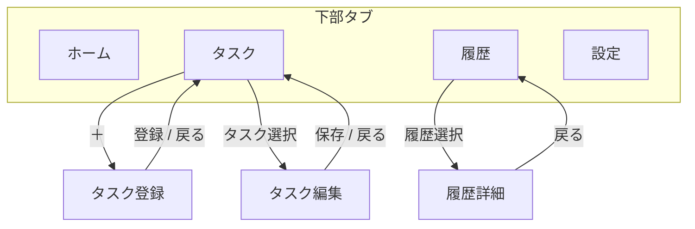

# 実行支援 基本設計書

## 1. この文書の位置づけ

`実行支援.md` は、人間が読むための基本設計書です。
アプリの目的、画面、主要データ、外部連携、振る舞いの全体像を共有することを目的とします。

実装方式、API 詳細、内部処理ルール、開発運用メモは `AGENT.md` を参照します。

## 2. アプリ概要

- アプリ名: 実行支援
- リポジトリ名: `task-reminder`
- 想定構成: PWA / Vercel / Supabase / Google Calendar API
- 想定利用者: 単一ユーザー

## 3. 目的

- 指定時刻にタスクを通知する
- 未完了のタスクを完了するまで再通知する
- 完了したタスクを実績として記録する
- 完了実績を Google Calendar に連携する

## 4. 基本方針

- タスクは削除せず、有効・無効で管理する
- 実行履歴は予定単位で保持する
- 通知間隔はタスクごとに設定する
- Google Calendar へ登録するのは完了実績のみとする
- スキップは履歴として残すが、Google Calendar には登録しない

## 5. 業務イメージ

利用者はタスクを登録し、予定時刻に通知を受け取ります。
通知を受けたタスクは、完了するか、今回分をスキップするまで未完了として扱われます。
完了したタスクは履歴に残り、必要に応じて Google Calendar に実績登録されます。

## 6. 主要機能

### 6.1 タスク管理

- タスクを登録できる
- タスクを編集できる
- タスクを有効・無効に切り替えられる
- 実行条件は `once / daily / weekly` を扱う

### 6.2 実行管理

- 予定時刻ごとに実行履歴を持つ
- 各履歴は `pending / completed / skipped` のいずれかで管理する
- `pending` は `completed` または `skipped` に遷移する

### 6.3 通知

- 予定時刻に初回通知する
- 未完了であれば通知間隔ごとに再通知する
- 完了またはスキップで通知を停止する

### 6.4 外部連携

- Push 通知を利用できる
- Google Calendar を接続できる
- 完了実績のみ Google Calendar に登録する

## 7. データの考え方

### 7.1 タスク

タスク自体の定義を保持します。

- タスク名
- 説明
- 実行条件
- 通知間隔
- 有効・無効

### 7.2 実行履歴

各予定日時ごとの状態を保持します。

- 予定日時
- 実行状態
- 次回通知日時
- 完了日時
- スキップ日時
- Google Calendar 連携結果

### 7.3 通知先情報

Push 通知の購読情報を保持します。

### 7.4 アプリ設定

Google Calendar 連携に必要な設定情報を保持します。

## 8. 画面構成

1. ホーム
2. タスク一覧
3. タスク登録
4. タスク編集
5. 設定

### 8.1 ホーム

- 超過中の未完了タスクを表示する
- 今日これから実行するタスクを表示する
- 各タスクに対して完了・スキップ操作を行える

### 8.2 タスク一覧

- 有効・無効を含めてタスクを一覧表示する
- タスク登録画面へ遷移できる
- 既存タスクの編集画面へ遷移できる

### 8.3 タスク登録 / 編集

- タスク名
- 説明
- 実行条件
- 通知間隔
- 有効・無効

を設定できる。

### 8.4 設定

- Google Calendar の接続状態を確認できる
- Push 通知の利用状態を確認できる
- テスト通知や接続確認を行える

## 9. 外部連携

### 9.1 Google Calendar

- 対象は `completed` のみ
- 登録内容はタスク名、完了日時、予定情報、説明を基本とする
- `skipped` は登録しない

### 9.2 Push 通知

- ブラウザの Push 機能を利用する
- 通知からアプリを開けること

## 10. 状態遷移

```text
pending
├── completed
└── skipped
```

## 11. 画面遷移



## 12. 非機能前提

- PWA として利用できること
- データの正本はサーバー側で管理すること
- オフライン時は一部表示できても、更新系はオンライン前提とする

## 13. 参照先

- 実装仕様: `AGENT.md`
- セットアップと起動手順: `README.md`
- DB 定義: `実行支援_DDL.sql`
